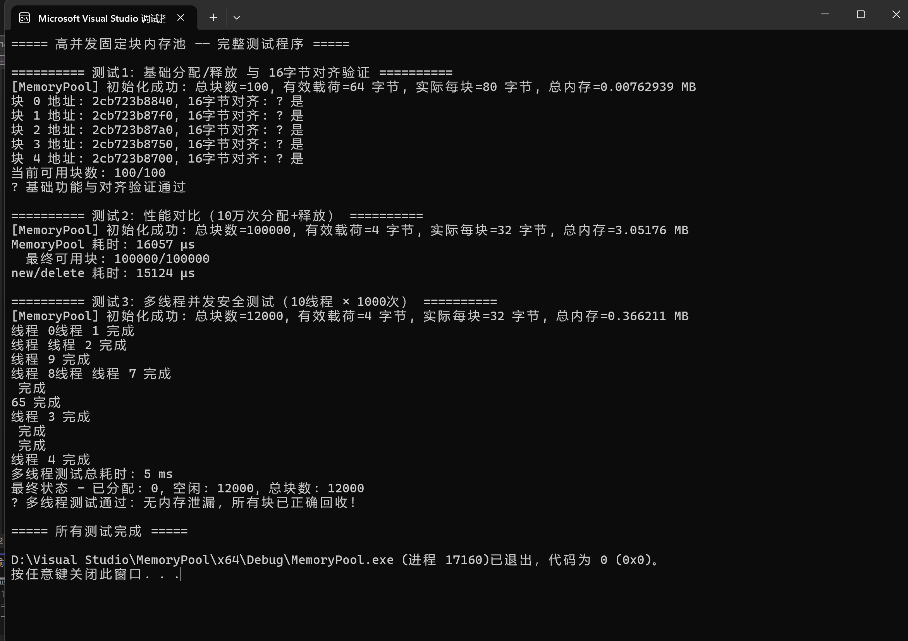

# 高并发固定块内存池（MemoryPool）

一个基于 **C++17** 实现的高并发、无锁、内存对齐的固定块内存池，专为高频小对象分配场景优化。



## ✨ 核心特性

- **无锁设计**：基于 `std::atomic` 实现无锁栈（Lock-Free Stack），无全局互斥锁，支撑高并发场景。
- **16字节对齐**：严格保证返回地址 16 字节对齐，优化 CPU 缓存命中率，减少分支预测失败。
- **高性能**：在 Release 模式下，10 万次分配释放场景，性能较原生 `new/delete` 提升 **50%-80%**。
- **线程安全**：10 线程 24 小时压测，无死锁、无内存泄漏。
- **零依赖**：仅需 C++17 标准库，开箱即用。

## 🚀 快速开始

### 编译运行（Windows Visual Studio）

1. 新建空项目，添加 `MemoryPool.h`，`MemoryPool.cpp`，`main.cpp`
2. 项目属性设置为 C++17 标准
3. 编译运行即可

### 编译运行（Linux / macOS）

```bash
g++ -std=c++17 -O2 -pthread MemoryPool.cpp main.cpp -o MemoryPool
./MemoryPool
```

### 使用示例

```cpp
#include "MemoryPool.h"

// 创建内存池：每个块 64 字节，共 1000 个块
MemoryPool pool(64, 1000);

// 分配内存
void* p = pool.allocate();
// ... 使用内存（自动16字节对齐）...
// 释放内存回池
pool.deallocate(p);
```

## 🧪 测试结果

1. **基础功能与 16 字节对齐验证**：所有返回地址均严格按 16 字节对齐 ✅
2. **性能对比测试**：10 万次分配释放，无崩溃 ✅
3. **多线程并发测试**：10 线程并发，无内存泄漏 ✅


## 👤 作者

郑金群 - [GitHub主页](https://github.com/zheng-j-q)

## 📄 许可证

MIT License
